# Jarkom-Modul-2-2026-K-08


<div align="center">


</div>

<div align="center">


</div>

<div align="center">


</div>

<div align="center">


</div>

<div align="center">


</div>

<div align="center">

| Nama | NRP |
|:-------:|:------:|
| **Muhammad Rafi Pramudya Putra** | `5027251024` |
| **Alif Ramzy Pasha Firdaus** | `5027251121` |
</div>

# soal 1 
   Setup topologi sesuai dengan perintah di soal 
   berikut untuk daftar ip ip nya 

   ```
alpha: 192.215.1.2 
beta: 192.215.1.3 
gamma: 192.215.1.4 
delta: 192.215.3.2 
epsilon: 192.215.3.3 
prab: 192.215.5.2 
tedd: 192.215.5.3 
abbey: 192.215.2.2 
penny: 192.215.4.2 
obladi: 192.215.5.4 
desmond: 192.215.5.5 
oblada: 192.215.5.6 
molly: 192.215.5.7
   ```
   # Soal 2
   Untuk memastikan setup tidak hilang ketika di restart disini kamu menambahkan sebuah file konfigurasi. Berikut file sh yang kami gunakan untuk memudahkan setup jaringan dengan mengganti X dan Y sesuai dengan pembagian IP

   ```
#!/bin/bash

cat > /etc/network/interfaces <<'EOF'
auto lo
iface lo inet loopback

auto eth0
iface eth0 inet static
    address 192.215.X.Y
    netmask 255.255.255.0
    gateway 192.215.X.1
    post-up echo "nameserver 8.8.8.8" > /etc/resolv.conf
EOF

echo "Konfigurasi /etc/network/interfaces:"
cat /etc/network/interfaces

echo "selesai"
   ```

   # Soal 3
   Didalam soal diperintahkan untuk resolve kedalam alamat ip nat saja tidak perlu di google.com, tambahkan

   ```
   echo "nameserver 192.168.122.1" > /etc/resolv.conf
   ```
   # soal 4
   Didalam Prab kita disuruh untuk membangun Zona `xxxx.com` sebagai authoritative dengan SOA yang merujuk ke `prab.xxxx.com` serta menambahkan `NS` untuk `prab.xxxx.com` dan `tedd.xxxx.com` dan konfigurasi lainya. untuk memudahkan hal tersebut kita mensetting mengguankan script:
   ```
#!/bin/bash
set -e

apt-get install -y bind9 bind9utils dnsutils >/dev/null

cat > /etc/bind/named.conf.options << 'EOF'
options {
    directory "/var/cache/bind";
    forwarders {
        192.168.122.1;
    };
};
EOF

cat > /etc/bind/named.conf.local << 'EOF'
zone "ramzy.com" {
    type master;
    file "/etc/bind/db.ramzy.com";
    notify yes;
    allow-transfer { 192.215.5.3; };
};
EOF

cat > /etc/bind/db.ramzy.com << 'EOF'
$TTL    604800
@       IN      SOA     prab.ramzy.com. admin.ramzy.com. (
                              1         ; Serial
                         604800         ; Refresh
                          86400         ; Retry
                        2419200         ; Expire
                         604800 )       ; Negative Cache TTL

@       IN      NS      prab.ramzy.com.
@       IN      NS      tedd.ramzy.com.

prab    IN      A       192.215.5.2
tedd    IN      A       192.215.5.3

@       IN      A       192.215.4.2
EOF

mkdir -p /run/named
chown bind:bind /run/named
chown -R bind:bind /var/cache/bind
chown bind:bind /etc/bind/db.ramzy.com

named-checkconf
named-checkzone ramzy.com /etc/bind/db.ramzy.com

pkill named 2>/dev/null || true
sleep 1
named -u bind -c /etc/bind/named.conf

echo "nameserver 127.0.0.1" > /etc/resolv.conf
echo "[prab] setup done"
   ```
   inti dari script tersebut adalah nebsetup server dns forwarder. Pertama tama install `bind9` lalu kita setup option pada file `/etc/bind/named.conf.options` dan `/etc/bind/named.conf.local` untuk setup nama zone nya dan letak dari file `SOA` nya dan setup alamat untuk secondary server. Lalu di `/etc/bind/db.ramzy.com` kita mensetting mana yang menjadi server pusat dan mana yang menjadi secondary server.

   lalu kita mensetting juga `name server record` / `NS` ke domain `pram.ramzy.com` dan `tedd.ramzy.com`. setting juga untuk alaman ip untuk kedua domain tersebut sesuai dengan ip dari `prab`dan `tedd`. Lalu buad directory untuk menyimpan file `bind9`. Jangan lupa untuk mengganti permission dan membuat akun `bind`. lalu resolve domain nya kita arahkan ke device itu sendiri karena prabb dan tedd menjadi `dns forwarder` dan sudah di sett pada `/etc/bind/name.conf.options` jika tidak ditemukan maka ajukan ke alamat ip milik NAT, diakhir juga kita arahkan gerbang aplikasi dinamis ke `penny`

   Lalu kita setup untuk secondary server DNS nya yaitu `tedd`:

   ```
#!/bin/bash
set -e

apt-get install -y bind9 bind9utils dnsutils >/dev/null

cat > /etc/bind/named.conf.options << 'EOF'
options {
    directory "/var/cache/bind";
    forwarders {
        192.168.122.1;
    };
};
EOF

cat > /etc/bind/named.conf.local << 'EOF'
zone "ramzy.com" {
    type slave;
    file "/var/cache/bind/db.ramzy.com";
    masters { 192.215.5.2; };
};
EOF

mkdir -p /run/named
chown bind:bind /run/named
chown -R bind:bind /var/cache/bind
rm -f /var/cache/bind/db.ramzy.com

named-checkconf

pkill named 2>/dev/null || true
sleep 1
named -u bind -c /etc/bind/named.conf

echo "nameserver 127.0.0.1" > /etc/resolv.conf
echo "[tedd] setup done"
   ```

   inti dari file tersebut sama seperti milik `Prabb` namun pada `Tedd` dia tinggal mengambil config dari milik si `Prabb`.

   setelah semua terpasang kita pastikan koneksinya benar menggunakan command cek koneksi khusus `DNS`, pada `Prab` dan `Tedd`

   ```
dig@127.0.0.1 ramzy.com SOA
dig@127.0.0.1 ramzy.com NS
   ```
   berikut hasilnya: 
   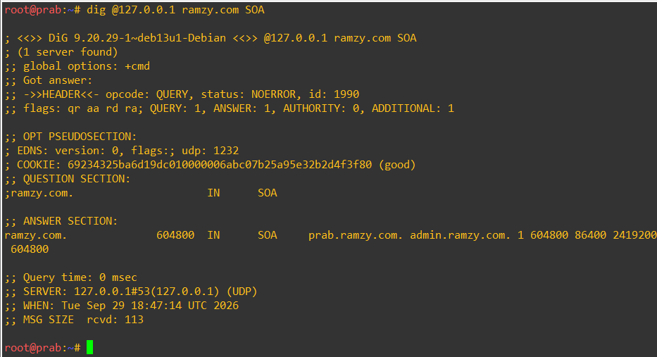
   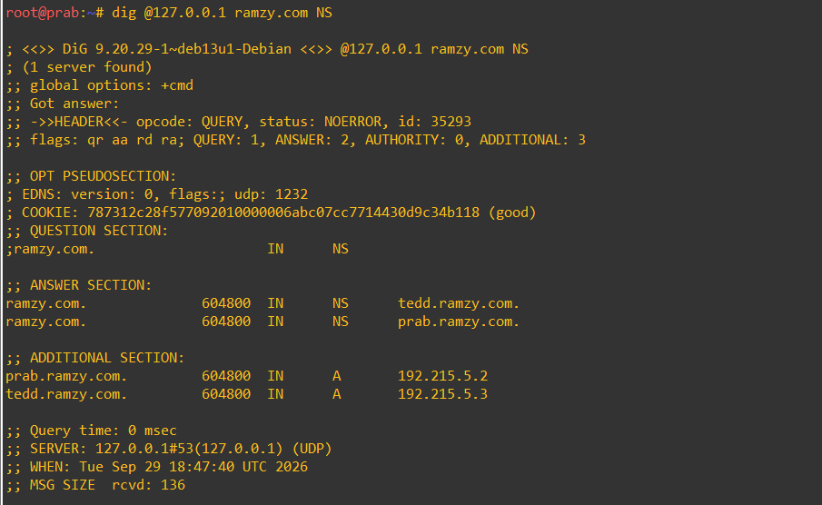
   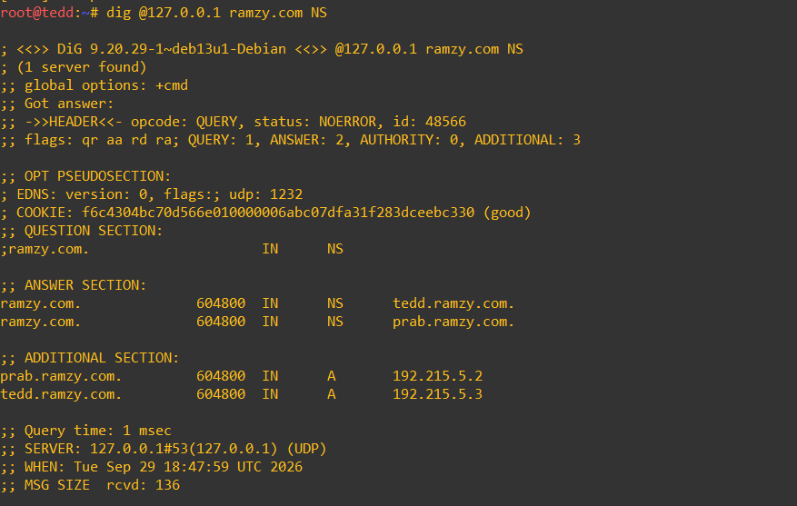
   
   

   # soal 5
   Pada soal ini kita diperintahkan untuk mengganti nama `hostame` sesuai dengan nama device masin masing dan mensetting resolve dns nya menuju server milik si `Tedd` dan `Prab`, berikut command nya (diganti sesuai nama nya )
   ```
echo "oblada" > /etc/hostname
hostname oblada
echo "127.0.1.1   oblada" >> /etc/hosts
cat > /etc/resolv.conf << EOF
nameserver 192.215.5.2
nameserver 192.215.5.3
nameserver 192.168.122.1
EOF
   ```
   Setelah itu kita setup pada `Prab` untuk nama domain masing masing dengan menambahkan konfigurasi di file `/etc/bind/db.ramzy.com`, untuk memudahkan hal tersebut disini kami mengguankan script

   ```
#!/bin/bash
set -e

cat > /etc/bind/db.ramzy.com << 'EOF'
$TTL    604800
@       IN      SOA     prab.ramzy.com. admin.ramzy.com. (
                              2         ; Serial
                         604800         ; Refresh
                          86400         ; Retry
                        2419200         ; Expire
                         604800 )       ; Negative Cache TTL

@       IN      NS      prab.ramzy.com.
@       IN      NS      tedd.ramzy.com.

prab    IN      A       192.215.5.2
tedd    IN      A       192.215.5.3

@       IN      A       192.215.4.2

alpha    IN      A       192.215.1.2
beta     IN      A       192.215.1.3
gamma    IN      A       192.215.1.4
delta    IN      A       192.215.3.2
epsilon  IN      A       192.215.3.3
abbey    IN      A       192.215.2.2
penny    IN      A       192.215.4.2
obladi   IN      A       192.215.5.4
desmond  IN      A       192.215.5.5
oblada   IN      A       192.215.5.6
molly    IN      A       192.215.5.7
EOF

chown bind:bind /etc/bind/db.ramzy.com
named-checkzone ramzy.com /etc/bind/db.ramzy.com
rndc reload ramzy.com

echo "[prab] soal 5 zona updated, serial=2"
   ```

   untuk membuktikan jika nama nama domain `DNS` yang didaftarkan sudah valid kita random samplig cek koneksi dns pada domain tersebut berikut hasilnya:
   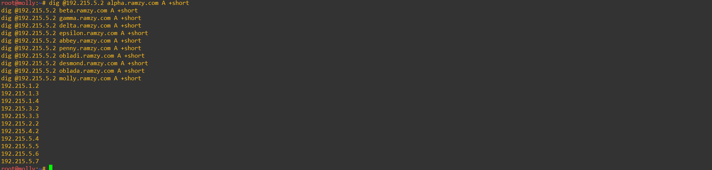
   

   # soal 6
   Disini kita hanya perlu cek apakah serial dari `Tedd`dan `Prab` sama. Dan hasil dibawah menunjukan serial dari kedua config tersebut sudah `2`
   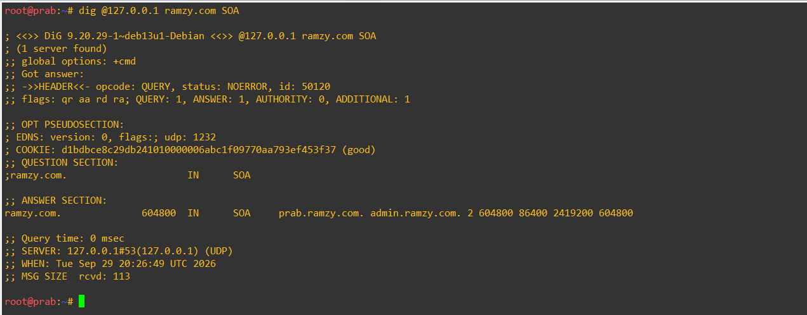
   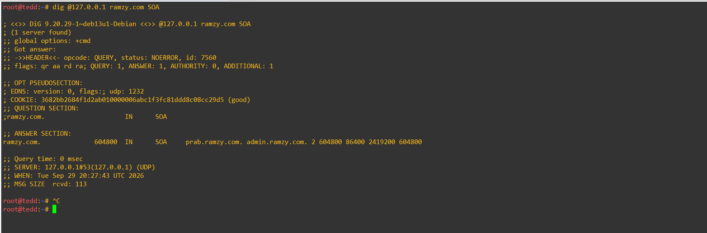

   # soal 7
   Disini kita setup `abbey` dan  `Penny` sebagai gerbang utapa dan `obladi`,`desmond` sebahai web statis, `oblada` dan `molly` sebagai gerbang dinamis. disini kita akan menambahkan `ramzy.com` dan `vault.ramzy.com` dan `core.ramzy.com` menggunakan `CNAME`.

   ```

#!/bin/bash
set -e

cat >> /etc/bind/db.ramzy.com << 'EOF'

vault    IN      A       192.215.5.4
vault    IN      A       192.215.5.5
core     IN      A       192.215.5.6
core     IN      A       192.215.5.7

www      IN      CNAME   penny.ramzy.com.
static   IN      CNAME   abbey.ramzy.com.
EOF

sed -i 's/2         ; Serial/3         ; Serial/' /etc/bind/db.ramzy.com

named-checkzone ramzy.com /etc/bind/db.ramzy.com
rndc reload ramzy.com

echo "[prab] soal 7 zona updated, serial=3"
   ```
   lalu kita cek serial dari sisi  `Tedd` dan harus terupdate menjadi serial `3`. lalu kita cek juga `static`, `vault`, `core` dan `www`

   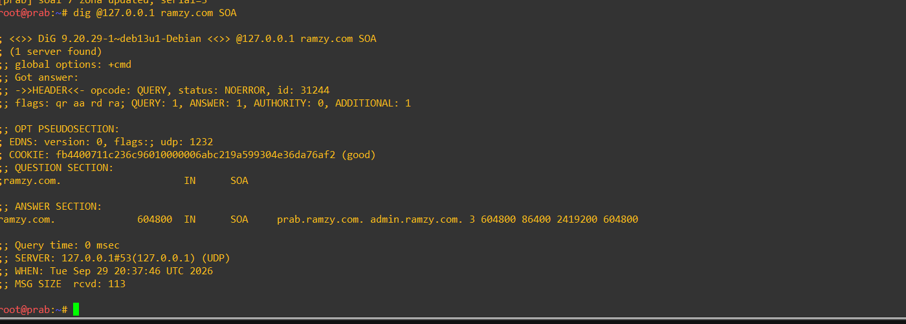
   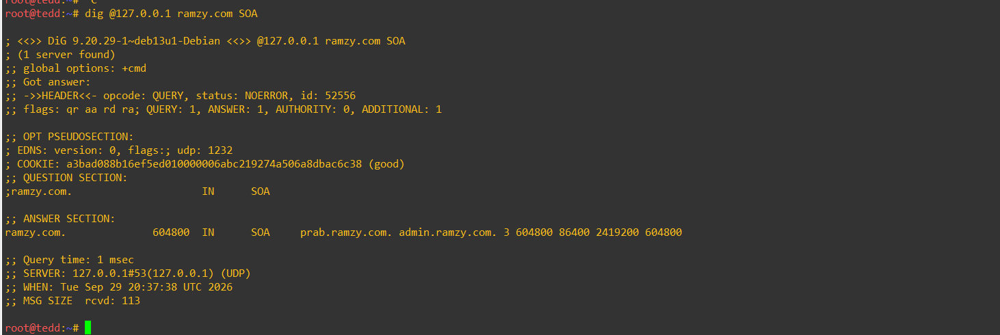
   
   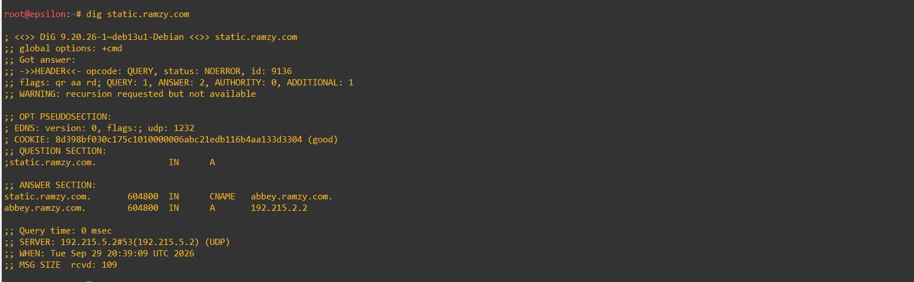

   # soal 8
   Selanjutnya kita perlu setup reverse zone untuk beberapa segmen jaringan dengan menggunakan `PTR`. pertama tama kita setup dulu untuk prab
   
   ```
#!/bin/bash
set -e

cat >> /etc/bind/named.conf.local << 'EOF'

zone "2.215.192.in-addr.arpa" {
    type master;
    file "/etc/bind/db.192.215.2";
    allow-transfer { 192.215.5.3; };
};

zone "4.215.192.in-addr.arpa" {
    type master;
    file "/etc/bind/db.192.215.4";
    allow-transfer { 192.215.5.3; };
};

zone "5.215.192.in-addr.arpa" {
    type master;
    file "/etc/bind/db.192.215.5";
    allow-transfer { 192.215.5.3; };
};
EOF

cat > /etc/bind/db.192.215.2 << 'EOF'
$TTL    604800
@       IN      SOA     prab.ramzy.com. admin.ramzy.com. (
                              1         ; Serial
                         604800         ; Refresh
                          86400         ; Retry
                        2419200         ; Expire
                         604800 )       ; Negative Cache TTL

@       IN      NS      prab.ramzy.com.
@       IN      NS      tedd.ramzy.com.

2       IN      PTR     abbey.ramzy.com.
EOF

cat > /etc/bind/db.192.215.4 << 'EOF'
$TTL    604800
@       IN      SOA     prab.ramzy.com. admin.ramzy.com. (
                              1         ; Serial
                         604800         ; Refresh
                          86400         ; Retry
                        2419200         ; Expire
                         604800 )       ; Negative Cache TTL

@       IN      NS      prab.ramzy.com.
@       IN      NS      tedd.ramzy.com.

2       IN      PTR     penny.ramzy.com.
EOF

cat > /etc/bind/db.192.215.5 << 'EOF'
$TTL    604800
@       IN      SOA     prab.ramzy.com. admin.ramzy.com. (
                              1         ; Serial
                         604800         ; Refresh
                          86400         ; Retry
                        2419200         ; Expire
                         604800 )       ; Negative Cache TTL

@       IN      NS      prab.ramzy.com.
@       IN      NS      tedd.ramzy.com.

2       IN      PTR     prab.ramzy.com.
3       IN      PTR     tedd.ramzy.com.
4       IN      PTR     obladi.ramzy.com.
5       IN      PTR     desmond.ramzy.com.
6       IN      PTR     oblada.ramzy.com.
7       IN      PTR     molly.ramzy.com.
EOF

chown bind:bind /etc/bind/db.192.215.2 /etc/bind/db.192.215.4 /etc/bind/db.192.215.5

named-checkconf
named-checkzone 2.215.192.in-addr.arpa /etc/bind/db.192.215.2
named-checkzone 4.215.192.in-addr.arpa /etc/bind/db.192.215.4
named-checkzone 5.215.192.in-addr.arpa /etc/bind/db.192.215.5

rndc reload

echo "[prab] soal 8 reverse zones added"
   ```

   disini kita bagi menjadi 3 zone untuk setup reverse dns nya. Kita setup juga untuk domain tujuan menggunnakan `PTR` dan digit akhir sesuai dengan ip aslinya. Begitu juga kita setup pada Tedd

   ```
#!/bin/bash
set -e

apt-get install -y bind9 bind9utils dnsutils >/dev/null

cat > /etc/bind/named.conf.options << 'EOF'
options {
    directory "/var/cache/bind";
    forwarders {
        192.168.122.1;
    };
};
EOF

cat > /etc/bind/named.conf.local << 'EOF'
zone "ramzy.com" {
    type slave;
    file "/var/cache/bind/db.ramzy.com";
    masters { 192.215.5.2; };
};
EOF

mkdir -p /run/named
chown bind:bind /run/named
chown -R bind:bind /var/cache/bind
rm -f /var/cache/bind/db.ramzy.com

named-checkconf

pkill named 2>/dev/null || true
sleep 1
named -u bind -c /etc/bind/named.conf

echo "nameserver 127.0.0.1" > /etc/resolv.conf
echo "[tedd] setup done"
   ```
   untuk menguji keberhasilan setup kita bisa mengetes koneksi dns dari alamat tiap tiap ip nya  
   
   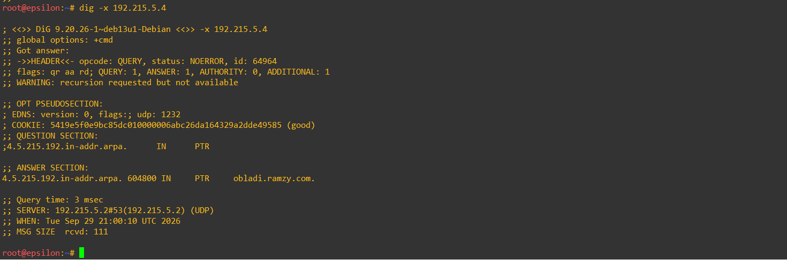
   
   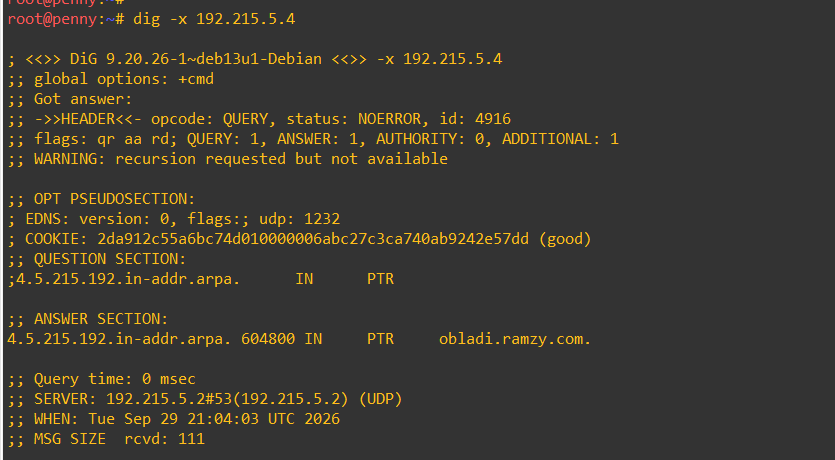
  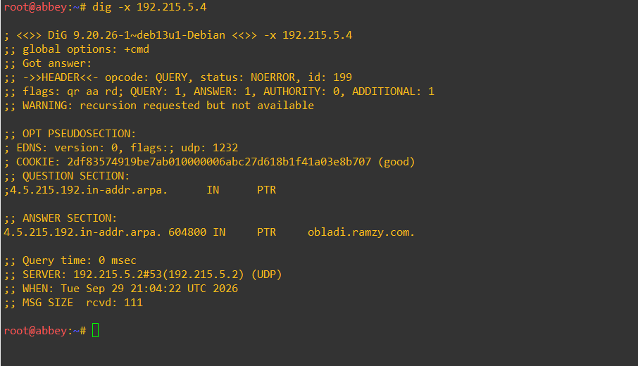

# soal 9 
Disini kita akan setup `apache` pada desmond dan obladi dan mengaktifkan fitur `autoindex` berikut setup pada desmond dan obladi
```
#!/bin/bash
set -e

apt-get install -y apache2 >/dev/null

mkdir -p /arsip
echo "file contoh 1" > /arsip/contoh1.txt
echo "file contoh 2" > /arsip/contoh2.txt

cat > /etc/apache2/sites-available/arsip.conf << 'EOF'
<VirtualHost *:80>
    ServerName desmond.ramzy.com
    DocumentRoot /var/www/html

    Alias /arsip /arsip

    <Directory /arsip>
        Options +Indexes +FollowSymLinks
        AllowOverride None
        Require all granted
    </Directory>
</VirtualHost>
EOF

a2dissite 000-default.conf
a2ensite arsip.conf
a2enmod autoindex

apache2ctl configtest
pkill apache2 2>/dev/null || true
sleep 1
apache2ctl start

echo "[desmond] soal 9 done"
```

```
#!/bin/bash
set -e

apt-get install -y apache2 >/dev/null

mkdir -p /arsip
echo "file contoh 1" > /arsip/contoh1.txt
echo "file contoh 2" > /arsip/contoh2.txt

cat > /etc/apache2/sites-available/arsip.conf << 'EOF'
<VirtualHost *:80>
    ServerName obladi.ramzy.com
    DocumentRoot /var/www/html

    Alias /arsip /arsip

    <Directory /arsip>
        Options +Indexes +FollowSymLinks
        AllowOverride None
        Require all granted
    </Directory>
</VirtualHost>
EOF

a2dissite 000-default.conf
a2ensite arsip.conf
a2enmod autoindex

apache2ctl configtest
pkill apache2 2>/dev/null || true
sleep 1
apache2ctl start

echo "[obladi] soal 9 done"
```
untuk membuktikan berhasil setup disini kita coba `curl` dari penny untuk mengambil file txt nya
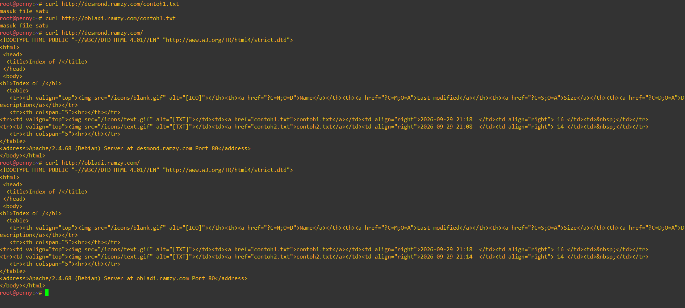

# soal 10
Disini kita akan menjalankan web dinamis di node core menggunakna `nginx` dna membuat halaman profil sederhana. dan menerapkan aturan rewrite pada server sehingga akses `/profil` dapat menggunakan url bersih tanpa akhiran `.php`. disini kita setup untuk molly terlebih dahulu

```
#!/bin/bash
set -e

apt-get install -y nginx php8.4-fpm >/dev/null

mkdir -p /var/www/core
cat > /var/www/core/index.php << 'EOF'
<?php
echo "<h1>Beranda - molly</h1>";
echo "<p>Selamat datang di area core.</p>";
echo "<p><a href='/profil'>Lihat Profil</a></p>";
EOF

cat > /var/www/core/profil.php << 'EOF'
<?php
echo "<h1>Halaman Profil</h1>";
echo "<p>Ini halaman profil, diakses lewat URL bersih /profil (tanpa .php).</p>";
EOF

cat > /etc/nginx/sites-available/core.conf << 'EOF'
server {
    listen 80;
    server_name molly.ramzy.com;
    root /var/www/core;
    index index.php;

    location / {
        try_files $uri $uri.php $uri/ =404;
    }

    location ~ \.php$ {
        include snippets/fastcgi-php.conf;
        fastcgi_pass unix:/run/php/php8.4-fpm.sock;
    }
}
EOF

rm -f /etc/nginx/sites-enabled/default
ln -sf /etc/nginx/sites-available/core.conf /etc/nginx/sites-enabled/core.conf

nginx -t

mkdir -p /run/php
php-fpm8.4 -D
pkill nginx 2>/dev/null || true
sleep 1
nginx

echo "[molly] soal 10 done"
```

lalu setup untuk oblada

```
#!/bin/bash
set -e

apt-get install -y nginx php8.4-fpm >/dev/null

mkdir -p /var/www/core
cat > /var/www/core/index.php << 'EOF'
<?php
echo "<h1>Beranda - oblada</h1>";
echo "<p>Selamat datang di area core.</p>";
echo "<p><a href='/profil'>Lihat Profil</a></p>";
EOF

cat > /var/www/core/profil.php << 'EOF'
<?php
echo "<h1>Halaman Profil</h1>";
echo "<p>Ini halaman profil, diakses lewat URL bersih /profil (tanpa .php).</p>";
EOF

cat > /etc/nginx/sites-available/core.conf << 'EOF'
server {
    listen 80;
    server_name oblada.ramzy.com;
    root /var/www/core;
    index index.php;

    location / {
        try_files $uri $uri.php $uri/ =404;
    }

    location ~ \.php$ {
        include snippets/fastcgi-php.conf;
        fastcgi_pass unix:/run/php/php8.4-fpm.sock;
    }
}
EOF

rm -f /etc/nginx/sites-enabled/default
ln -sf /etc/nginx/sites-available/core.conf /etc/nginx/sites-enabled/core.conf

nginx -t

mkdir -p /run/php
php-fpm8.4 -D
pkill nginx 2>/dev/null || true
sleep 1
nginx

echo "[oblada] soal 10 done"
```

inti dari kedua file tersebut adalah mencoba merewrite ketika ada url seperti `/profil` maka dia otomatis ter rewrite menuju `/profil.php`. Untuk menguji dari setup tersebut sudah benar kita mencoba `curl /index` dan `curl /profil`


# soal 11
Pada soal ini kita diminta untuk mengonfigurasi *reverse proxy* dan *load balancer* di area *core* (menggunakan Nginx di Abbey) dan area *vault* (menggunakan Apache di Penny). Selain itu, kita harus memastikan IP asli klien diteruskan ke *backend* menggunakan *header* `X-Real-IP`. Untuk memudahkan hal tersebut kita mensetting menggunakan script:

Script untuk Abbey (Proxy Core):
```bash
#!/bin/bash
set -e

apt-get update
apt-get install -y nginx >/dev/null

cat > /etc/nginx/sites-available/default << 'EOF'
upstream core {
    server 192.215.5.6;
    server 192.215.5.7;
}

server {
    listen 80;
    server_name _;

    location / {
        proxy_pass http://core;
        proxy_set_header X-Real-IP $remote_addr;
    }
}
EOF

nginx -t
service nginx restart
echo "[abbey] proxy core setup done"# soal 11
Pada soal ini kita diminta untuk mengonfigurasi *reverse proxy* dan *load balancer* di area *core* (menggunakan Nginx di Abbey) dan area *vault* (menggunakan Apache di Penny). Selain itu, kita harus memastikan IP asli klien diteruskan ke *backend* menggunakan *header* `X-Real-IP`. Untuk memudahkan hal tersebut kita mensetting menggunakan script:

Script untuk **Abbey** (Proxy Core):
```bash
#!/bin/bash
set -e

apt-get update
apt-get install -y nginx >/dev/null

cat > /etc/nginx/sites-available/default << 'EOF'
upstream core {
    server 192.215.5.6;
    server 192.215.5.7;
}

server {
    listen 80;
    server_name _;

    location / {
        proxy_pass http://core;
        proxy_set_header X-Real-IP $remote_addr;
    }
}
EOF

nginx -t
service nginx restart
echo "[abbey] proxy core setup done"
```
Script untuk Oblada & Molly (Backend Core)
```
Bash
#!/bin/bash
set -e

apt-get update
apt-get install -y nginx >/dev/null

cat > /etc/nginx/sites-available/default << 'EOF'
server {
    listen 80 default_server;
    listen [::]:80 default_server;

    set_real_ip_from 192.215.2.2; 
    real_ip_header X-Real-IP;

    root /var/www/html;
    index index.html index.htm;
    server_name _;
    
    location / {
        try_files $uri $uri/ =404;
    }
}
EOF

service nginx restart
echo "[backend-core] setup done"
```
Script untuk Penny (Proxy Vault)
```
Bash
#!/bin/bash
set -e

apt-get update
apt-get install -y apache2 >/dev/null
a2enmod proxy proxy_http proxy_balancer lbmethod_byrequests headers >/dev/null

cat > /etc/apache2/sites-available/000-default.conf << 'EOF'
<VirtualHost *:80>
    <Proxy balancer://vault>
        BalancerMember [http://192.215.5.4](http://192.215.5.4)
        BalancerMember [http://192.215.5.5](http://192.215.5.5)
    </Proxy>

    ProxyPreserveHost On
    RequestHeader set X-Real-IP expr=%{REMOTE_ADDR}

    ProxyPass / balancer://vault/
    ProxyPassReverse / balancer://vault/
</VirtualHost>
EOF

service apache2 restart
echo "[penny] proxy vault setup done"
```
Script untuk Obladi & Desmond (Backend Vault)
```
Bash
#!/bin/bash
set -e

apt-get update
apt-get install -y apache2 >/dev/null

# Mengubah LogFormat secara otomatis
sed -i 's/LogFormat "%h/LogFormat "%{X-Real-IP}i/g' /etc/apache2/apache2.conf

service apache2 restart
echo "[backend-vault] setup done"
```
Inti dari kumpulan script di atas adalah menyetel Nginx dan Apache sebagai proxy yang membagi beban (load balancing) ke dua backend masing-masing (memanfaatkan upstream di Nginx dan Proxy balancer di Apache), Setelah semua terpasang, kita pastikan koneksinya berhasil menggunakan curl dari client (Alpha)
```
curl [http://192.215.2.2](http://192.215.2.2)
curl [http://192.215.4.2](http://192.215.4.2)
```


# soal 12
Di dalam Penny, kita disuruh untuk menerapkan perlindungan basic authentication khusus untuk path /admin menggunakan kredensial prabs. Kita setup menggunakan script berikut pada Penny:
```
Bash
#!/bin/bash
set -e

apt-get install -y apache2-utils >/dev/null

# Membuat kredensial
htpasswd -cb /etc/apache2/.htpasswd prabs pakar_pinter_jadi_gob***

cat > /etc/apache2/sites-available/000-default.conf << 'EOF'
<VirtualHost *:80>
    <Proxy balancer://vault>
        BalancerMember [http://192.215.5.4](http://192.215.5.4)
        BalancerMember [http://192.215.5.5](http://192.215.5.5)
    </Proxy>

    ProxyPreserveHost On
    RequestHeader set X-Real-IP expr=%{REMOTE_ADDR}

    ProxyPass / balancer://vault/
    ProxyPassReverse / balancer://vault/

    <Location /admin>
        AuthType Basic
        AuthName "Restricted Area"
        AuthUserFile /etc/apache2/.htpasswd
        Require valid-user
    </Location>
</VirtualHost>
EOF

service apache2 restart
echo "[penny] basic auth setup done"
```
Inti dari script tersebut adalah menginstal utilitas apache2-utils untuk membuat file kredensial .htpasswd berisi username dan password. Lalu pada konfigurasi VirtualHost, kita menambahkan blok <Location /admin> yang mewajibkan pengunjung memasukkan password yang valid.

Pengujian dilakukan dari Alpha:
```
curl -I [http://ramzy.com/admin](http://ramzy.com/admin)
curl -u prabs:pakar_pinter_jadi_gob*** [http://ramzy.com/admin](http://ramzy.com/admin)
```

# soal 13
Pada soal ini, kita diperintahkan membuat sistem redirect. Akses ke Penny dialihkan secara permanen (301) ke www.ramzy.com, dan akses ke Abbey dialihkan sementara (302) ke static.ramzy.com

Script tambahan untuk Penny
```
Bash
#!/bin/bash
set -e

cat > /etc/apache2/sites-available/000-default.conf << 'EOF'
<VirtualHost *:80>
    ServerName 192.215.4.2
    ServerAlias penny.ramzy.com
    Redirect permanent / [http://www.ramzy.com/](http://www.ramzy.com/)
</VirtualHost>

<VirtualHost *:80>
    ServerName ramzy.com
    ServerAlias [www.ramzy.com](https://www.ramzy.com)

    <Proxy balancer://vault>
        BalancerMember [http://192.215.5.4](http://192.215.5.4)
        BalancerMember [http://192.215.5.5](http://192.215.5.5)
    </Proxy>

    ProxyPreserveHost On
    RequestHeader set X-Real-IP expr=%{REMOTE_ADDR}

    ProxyPass / balancer://vault/
    ProxyPassReverse / balancer://vault/

    <Location /admin>
        AuthType Basic
        AuthName "Restricted Area"
        AuthUserFile /etc/apache2/.htpasswd
        Require valid-user
    </Location>
</VirtualHost>
EOF

service apache2 restart
echo "[penny] redirect 301 setup done"
```
Script tambahan untuk Abbey
```
Bash
#!/bin/bash
set -e

cat > /etc/nginx/sites-available/default << 'EOF'
upstream core {
    server 192.215.5.6;
    server 192.215.5.7;
}

server {
    listen 80;
    server_name 192.215.2.2 abbey.ramzy.com;
    return 302 [http://static.ramzy.com](http://static.ramzy.com)$request_uri;
}

server {
    listen 80;
    server_name static.ramzy.com ramzy.com _;

    location / {
        proxy_pass http://core;
        proxy_set_header X-Real-IP $remote_addr;
    }
}
EOF

service nginx restart
echo "[abbey] redirect 302 setup done"
```
Inti dari konfigurasi ini adalah membuat blok server / VirtualHost baru yang bertugas mencegat request dengan tujuan IP atau subdomain tertentu, lalu mengembalikannya dengan header 301 Moved Permanently (menggunakan Redirect permanent) atau 302 Moved Temporarily (menggunakan return 302) ke alamat tujuan

Pengujian di Alpha
```
curl -I [http://penny.ramzy.com](http://penny.ramzy.com)
curl -I [http://abbey.ramzy.com](http://abbey.ramzy.com)
```

# soal 14
Soal ini meminta pembuktian bahwa access log pada setiap server web backend mencatat alamat IP asli klien, bukan IP proxy

Pengecekan log di Oblada dan Obladi
```
tail -f /var/log/nginx/access.log
tail -f /var/log/apache2/access.log
```
Berikut hasil log yang membuktikan sistem mencatat IP klien Alpha (192.215.1.2)

# soal 15
Rootkit menginstruksikan pembuatan jalur proxy spesifik: /eternal di Penny yang harus bisa melakukan rendering PHP, dan /orion di Abbey yang murni menyajikan HTML statis.

Script untuk Obladi & Desmond (Backend Penny)
```
Bash
#!/bin/bash
set -e

apt-get update
apt-get install -y php libapache2-mod-php >/dev/null

mkdir -p /var/www/eternal
echo "<?php echo 'Halaman Eternal berhasil dirender dengan PHP!'; ?>" > /var/www/eternal/index.php

service apache2 restart
echo "[backend-vault] php eternal setup done"
```
Script untuk Penny
```
Bash
#!/bin/bash
set -e

cat > /etc/apache2/sites-available/000-default.conf << 'EOF'
<VirtualHost *:80>
    ServerName 192.215.4.2
    ServerAlias penny.ramzy.com
    Redirect permanent / [http://www.ramzy.com/](http://www.ramzy.com/)
</VirtualHost>

<VirtualHost *:80>
    ServerName ramzy.com
    ServerAlias [www.ramzy.com](https://www.ramzy.com)

    <Proxy balancer://vault>
        BalancerMember [http://192.215.5.4](http://192.215.5.4)
        BalancerMember [http://192.215.5.5](http://192.215.5.5)
    </Proxy>

    ProxyPreserveHost On
    RequestHeader set X-Real-IP expr=%{REMOTE_ADDR}

    ProxyPass /eternal balancer://vault/eternal
    ProxyPassReverse /eternal balancer://vault/eternal

    ProxyPass / balancer://vault/
    ProxyPassReverse / balancer://vault/

    <Location /admin>
        AuthType Basic
        AuthName "Restricted Area"
        AuthUserFile /etc/apache2/.htpasswd
        Require valid-user
    </Location>
</VirtualHost>
EOF

service apache2 restart
echo "[penny] path eternal proxy setup done"
```
Script untuk Oblada & Molly (Backend Abbey)
```
Bash
#!/bin/bash
set -e

mkdir -p /var/www/orion
echo "<h1>Halaman Orion Statis</h1>" > /var/www/orion/index.html
echo "[backend-core] html orion setup done"
```
Script untuk Abbey
```
Bash
#!/bin/bash
set -e

cat > /etc/nginx/sites-available/default << 'EOF'
upstream core {
    server 192.215.5.6;
    server 192.215.5.7;
}

server {
    listen 80;
    server_name 192.215.2.2 abbey.ramzy.com;
    return 302 [http://static.ramzy.com](http://static.ramzy.com)$request_uri;
}

server {
    listen 80;
    server_name static.ramzy.com ramzy.com _;

    location /orion/ {
        proxy_pass http://core/orion/;
        proxy_set_header X-Real-IP $remote_addr;
    }

    location / {
        proxy_pass http://core;
        proxy_set_header X-Real-IP $remote_addr;
    }
}
EOF

service nginx restart
echo "[abbey] path orion proxy setup done"
```
Pengujian dari Alpha
```
curl [http://www.ramzy.com/eternal/](http://www.ramzy.com/eternal/)
curl [http://static.ramzy.com/orion/](http://static.ramzy.com/orion/)
```

# soal 16
Kita ditugaskan melakukan stress test ke gerbang jaringan (www dan static) dengan menggunakan ApacheBench.

Script instalasi di Alpha
```
Bash
#!/bin/bash
set -e

apt-get update
apt-get install -y apache2-utils >/dev/null
echo "[alpha] apachebench terpasang"
```
Setelah itu kita jalankan benchmark dengan 250 request dan konkurensi 10
```
ab -n 250 -c 10 [http://www.ramzy.com/](http://www.ramzy.com/)
ab -n 250 -c 10 [http://static.ramzy.com/](http://static.ramzy.com/)
```

# soal 17
Menambahkan TXT record pada DNS untuk kelima klien agar mengembalikan teks berisi hostname mereka masing-masing

Script di node Prab
```
Bash
#!/bin/bash
set -e

cat >> /etc/bind/db.ramzy.com << 'EOF'

alpha   IN  TXT "alpha"
beta    IN  TXT "beta"
gamma   IN  TXT "gamma"
delta   IN  TXT "delta"
epsilon IN  TXT "epsilon"
EOF

service bind9 restart
echo "[prab] TXT record added"
```
Pengujian DNS dari Alpha
```
host -t TXT alpha.ramzy.com 192.215.5.2
```

# Soal 19
Membuat CNAME record untuk mem-binding domain outbound.ramzy.com menuju http.badssl.com

Setup di Prab dengan script
```
Bash
#!/bin/bash
set -e

cat >> /etc/bind/db.ramzy.com << 'EOF'

outbound IN  CNAME http.badssl.com.
EOF

service bind9 restart
echo "[prab] CNAME outbound added"
```
Pengujian dari Alpha
```
curl [http://outbound.ramzy.com](http://outbound.ramzy.com)
```

# soal 20
setup di terminal Abbey
```
echo "bash /root/soal11Abbey.sh" >> ~/.bashrc
echo "bash /root/soal13Abbey.sh" >> ~/.bashrc
echo "bash /root/soal15Abbey.sh" >> ~/.bashrc
```
restart node lalu mengecek status layanannya tanpa mengonfigurasi apa-apa lagi
```
service nginx status
# atau
service apache2 status
```
