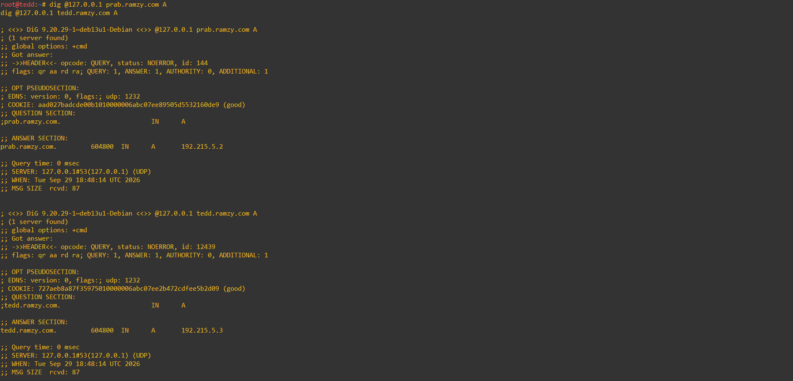
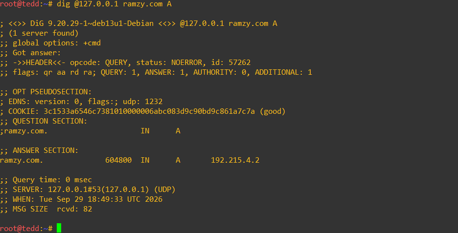
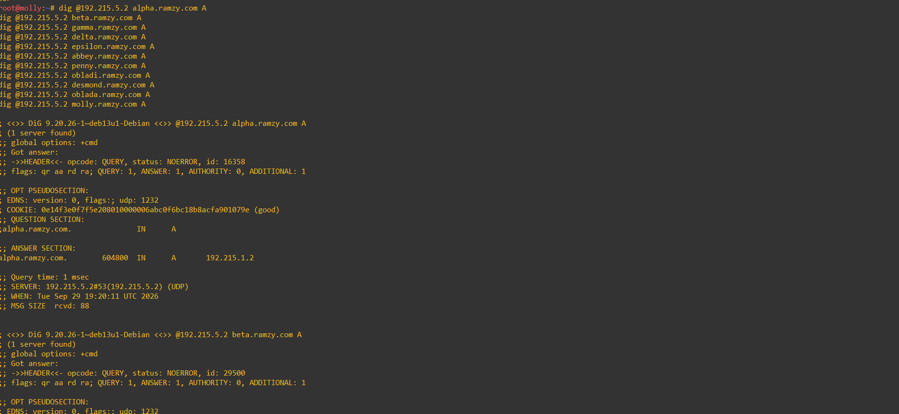
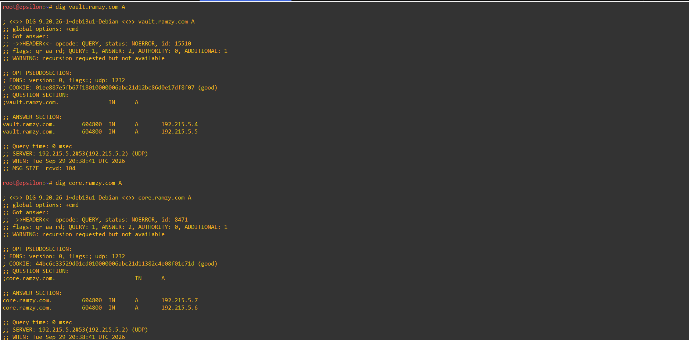
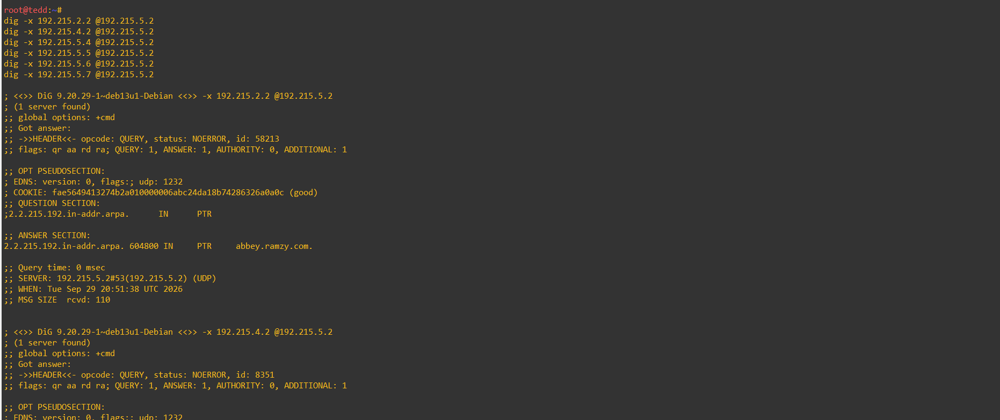
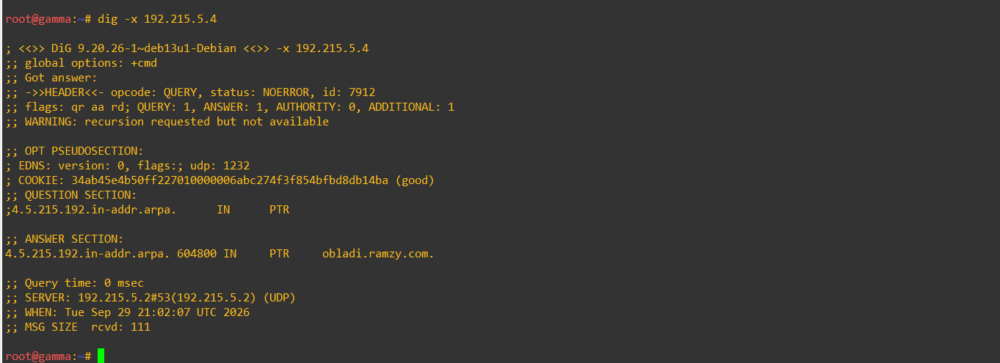
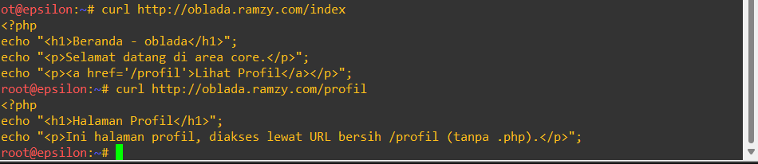

# cara menjalankannya 

tinggal jalankan tiap sh sesuai dengan nama sh tersebut. untuk device sh maka jalankan di tiap node non route dengan pengganti XY yang sesuai. Begitu juga untuk node template sh 


# Set up network

Route
```
auto lo
iface lo inet loopback

# eth0 -> WAN (Cloud/NAT)
auto eth0
iface eth0 inet dhcp
    post-up sysctl -w net.ipv4.ip_forward=1
    post-up iptables -t nat -C POSTROUTING -o eth0 -j MASQUERADE || iptables -t nat -A POSTROUTING -o eth0 -j MASQUERADE

# eth1 -> SW1 (alpha, beta, gamma)
auto eth1
iface eth1 inet static
    address 192.215.1.1
    netmask 255.255.255.0

# eth2 -> SW2 (delta, epsilon)
auto eth2
iface eth2 inet static
    address 192.215.2.1
    netmask 255.255.255.0

# eth3 -> SW3 (prab, tedd)
auto eth3
iface eth3 inet static
    address 192.215.3.1
    netmask 255.255.255.0

# eth4 -> SW4 (abbey, penny, obladi, desmond, oblada, molly)
auto eth4
iface eth4 inet static
    address 192.215.4.1
    netmask 255.255.255.0
```

device
```
auto lo
iface lo inet loopback

auto eth0
iface eth0 inet static
    address 192.215.X.Y
    netmask 255.255.255.0
    gateway 192.215.X.1
    post-up echo "nameserver 192.168.122.1" > /etc/resolv.conf
```

panduan lengkap Konfigurasi DNS Server BIND9 (Master & Slave)
Dokumen ini berisi langkah-langkah lengkap dari nol untuk mengonfigurasi prab sebagai Primary/Master DNS Server dan tedd sebagai Secondary/Slave DNS Server untuk domain `ramzy.com`.
---
Informasi Jaringan
Domain Name: `ramzy.com`
Master DNS (`prab`): `192.215.5.2`
Slave DNS (`tedd`): `192.215.5.3`
Upstream Forwarder: `192.168.122.1`
---
bagian 1: Konfigurasi Master DNS Server (prab)
1. Install Software BIND9
Jalankan pembaruan paket dan install BIND9 beserta utilitas pendukungnya:
```bash
apt update
apt install -y bind9 bind9utils dnsutils
```
2. Deklarasikan Zona Domain (Master)
Buka file `/etc/bind/named.conf.local`:
```bash
nano /etc/bind/named.conf.local
```
Tambahkan konfigurasi zona master berikut:
```text
zone "ramzy.com" {
    type master;
    file "/etc/bind/db.ramzy.com";
    notify yes;
    allow-transfer { 192.215.5.3; };
};
```
> **Penjelasan:**
> * `type master;` menentukan node ini sebagai pemilik utama data zona.
> * `notify yes;` memberi tahu slave secara otomatis ketika ada perubahan record.
> * `allow-transfer { 192.215.5.3; };` mengizinkan `tedd` untuk menyalin file zona.
3. Buat dan Isi File Record Domain
Buka file `/etc/bind/db.ramzy.com`:
```bash
nano /etc/bind/db.ramzy.com
```
Isi dengan SOA, NS, dan A Record untuk domain `ramzy.com`:
```text
$TTL    604800
@       IN      SOA     ramzy.com. root.ramzy.com. (
                              2         ; Serial
                         604800         ; Refresh
                          86400         ; Retry
                        2419200         ; Expire
                         604800 )       ; Negative Cache TTL
;
@       IN      NS      prab.ramzy.com.
@       IN      NS      tedd.ramzy.com.
@       IN      A       192.215.5.2
prab    IN      A       192.215.5.2
tedd    IN      A       192.215.5.3
```
4. Konfigurasi Opsi dan Forwarders
Buka file `/etc/bind/named.conf.options`:
```bash
nano /etc/bind/named.conf.options
```
Sesuaikan isinya:
```text
options {
    directory "/var/cache/bind";

    forwarders {
        192.168.122.1;
    };

};
```
5. Atur Hak Akses Direktori (Permissions)
Pastikan user `bind` memiliki hak akses penuh ke folder kerja:
```bash
mkdir -p /run/named
chown bind:bind /run/named
chown -R bind:bind /var/cache/bind
```
6. Jalankan Service BIND9
Eksekusi daemon BIND9 dengan perintah:
```bash
named -u bind -c /etc/bind/named.conf
```
7. Verifikasi dan Pengujian (prab)
Uji apakah DNS Master sudah merespons dengan benar:
```bash
dig @127.0.0.1 ramzy.com NS
```
---
bagian 2: Konfigurasi Slave DNS Server (tedd)
1. Install Software BIND9
Install paket BIND9 pada peranti `tedd`:
```bash
apt update
apt install -y bind9 bind9utils dnsutils
```
2. Deklarasikan Zona Domain (Slave)
Buka file `/etc/bind/named.conf.local`:
```bash
nano /etc/bind/named.conf.local
```
Tambahkan konfigurasi zona slave berikut:
```text
zone "ramzy.com" {
    type slave;
    file "/var/cache/bind/db.ramzy.com";
    masters { 192.215.5.2; };
};
```
> **Penjelasan:**
> * `type slave;` menandakan bahwa server ini menyalin data dari master.
> * `file "/var/cache/bind/db.ramzy.com";` lokasi penyimpanan hasil salinan (direktori yang dapat ditulis oleh user `bind`).
> * `masters { 192.215.5.2; };` mengarah ke IP `prab` sebagai sumber utama.
3. Konfigurasi Opsi dan Forwarders
Buka file `/etc/bind/named.conf.options`:
```bash
nano /etc/bind/named.conf.options
```
Sesuaikan isinya:
```text
options {
    directory "/var/cache/bind";

    forwarders {
        192.168.122.1;
    };

};
```
4. Atur Hak Akses Direktori (Permissions)
Persiapkan direktori kerja agar `tedd` dapat mengunduh dan menyimpan file dari `prab`:
```bash
mkdir -p /run/named
chown bind:bind /run/named
chown -R bind:bind /var/cache/bind
```
5. Jalankan Service BIND9
Jalankan BIND9. Pada saat dijalankan, `tedd` akan langsung mengontak `prab` dan mengunduh file zona `db.ramzy.com`:
```bash
named -u bind -c /etc/bind/named.conf
```
6. Verifikasi dan Pengujian (tedd)
Uji query DNS lokal di `tedd`:
```bash
   dig @127.0.0.1 ramzy.com NS
   ```
Pastikan file `db.ramzy.com` berhasil tersalin di direktori slave:
```bash
   ls -la /var/cache/bind/
   ```
   # soal 4
   
   
   
   
   

   # soal 5
   
   

   # soal 6
   

   # soal 7
   
   
   
   
   

   # soal 8
   
   
   
   


# soal 9 


# soal 10
